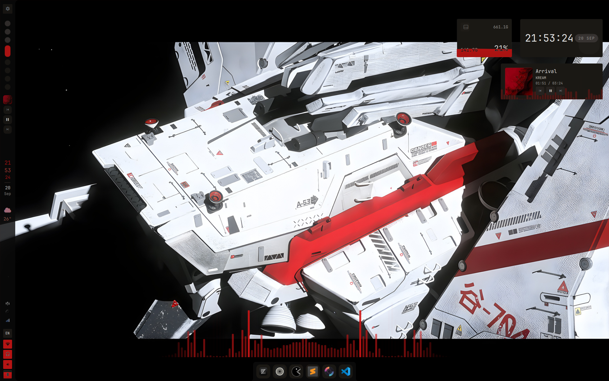
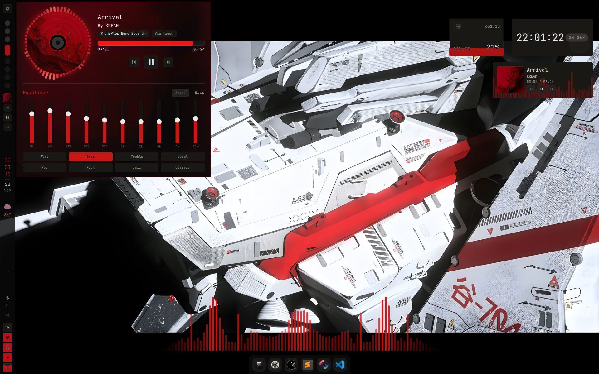
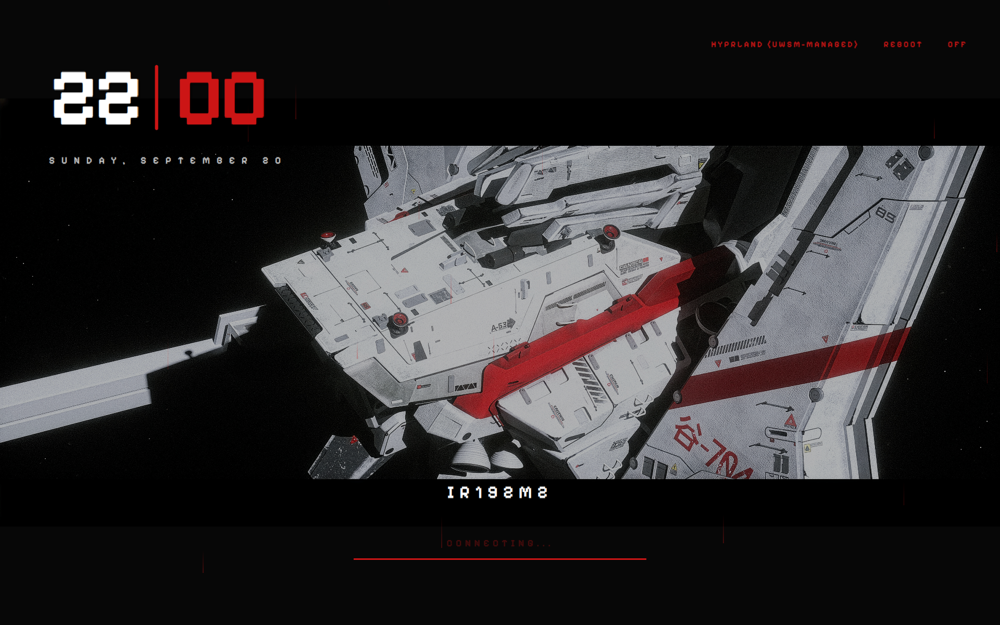
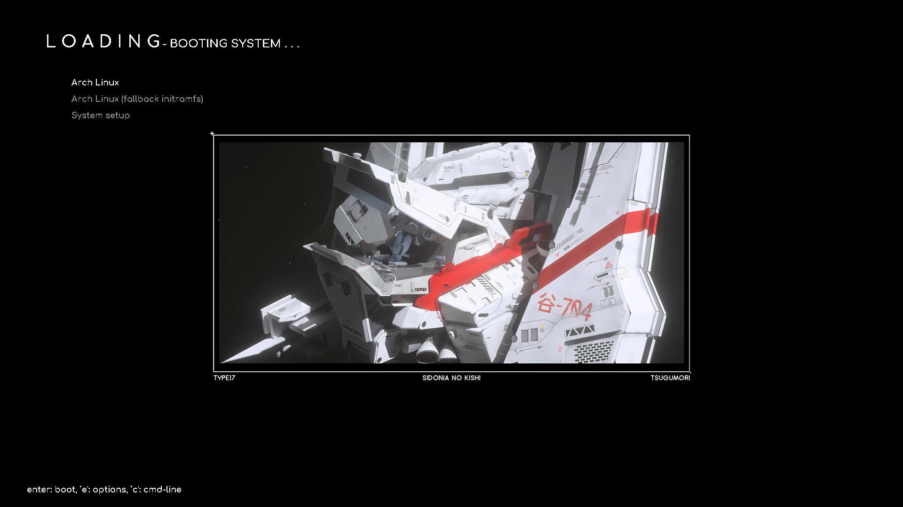

# Shidonia no Kishi

A Sidonia-themed fork of [serpantinum](https://github.com/ilyamiro/serpantinum), bundled with a set of matching SDDM and GRUB themes into a single repo with a single installer.

## Previews

| | |
| --- | --- |
|  |  |
|  |  |

## What's inside

| Piece | Location | Notes |
| --- | --- | --- |
| Serpantinum shell (forked) | `src/` | Sidonia color theme `src/assets/themes/Tsugumori.json`, left bar with thickness support, scaled time/date/weather widgets |
| SDDM theme | `config/sddm/themes/sidonia-no-kishi/` | "Sidonia night city" greeter, white + `#cc1515` red |
| GRUB theme | `config/grub/themes/sidonia-no-kishi/` | Yorha-style boot menu, white text + red accents (installer sets `GRUB_THEME`, `GRUB_FONT`, `GRUB_GFXMODE` and reruns `grub-mkconfig`) |
| Default settings | `config/serpantinum/settings.json` | Sidonia defaults: left bar, `Tsugumori` preset, thickness 48, overridden color palette |
| Packages | `install/modules/deps.sh` | Bundled deps incl. `overskride-bin` (Bluetooth) and `adw-gtk-theme` |
| Dark mode | `install/modules/darkmode.sh` | `prefer-dark` via gsettings + `adw-gtk3-dark` in GTK3/GTK4 settings |

Telemetry is **disabled** in this fork (no install/usage data leaves your machine).

## Installation

Run the installer locally:

```bash
bash install/install.sh
```

or directly from GitHub:

```bash
bash -c "$(curl -fsSL https://raw.githubusercontent.com/Copernicium282/Shidonia-no-Kishi/master/install/install.sh)"
```

The installer detects your compositor, installs dependencies (including `overskride-bin` and the dark-mode GTK theme), deploys the serpantinum shell, then:

1. installs the SDDM theme to `/usr/share/sddm/themes/sidonia-no-kishi` and activates it,
2. installs the GRUB theme to `/boot/grub/themes/sidonia-no-kishi`, rewrites `/etc/default/grub` (`GRUB_THEME`/`GRUB_FONT`/`GRUB_GFXMODE`), and regenerates `grub.cfg`,
3. enables system-wide dark mode (`color-scheme: prefer-dark` + `adw-gtk3-dark` for GTK3/GTK4 apps such as Nautilus and overskride).

Run `serpantinumd start` to launch the shell.

> [!IMPORTANT]
> **Migrating / updating:** the installer is stateful. Running it on a machine that already has a version installed enters the "update" flow — your configuration is backed up and preserved, and compositor files / existing configs are not overwritten on update.

> [!NOTE]
> To update, run the installer again and choose "update".

### NixOS

The repo provides flake outputs: a NixOS module for system dependencies, a Home Manager module, and a runnable package.

Add it to your `flake.nix`:

```nix
{
  inputs = {
    nixpkgs.url = "github:nixos/nixpkgs/nixos-unstable";
    shidonia.url = "github:Copernicium282/Shidonia-no-Kishi";
  };

  outputs = { self, nixpkgs, shidonia, ... }: {
    nixosConfigurations.nixos = nixpkgs.lib.nixosSystem {
      system = "x86_64-linux";
      specialArgs = { inherit shidonia; };
      modules = [
        ./configuration.nix
        shidonia.nixosModules.default
      ];
    };
  };
}
```

Enable the system module:

```nix
{
  programs.serpantinum.enable = true;
}
```

Or use the runnable package directly:

```nix
{ pkgs, shidonia, ... }:
{
  environment.systemPackages = [
    shidonia.packages.${pkgs.stdenv.hostPlatform.system}.default
  ];
}
```

Home Manager:

```nix
{ shidonia, ... }:
{
  imports = [ shidonia.homeManagerModules.default ];

  programs.serpantinum = {
    enable = true;
    systemd.enable = true;
    settings = {
      theme = { fontSize = 13; fontFamily = "JetBrains Mono"; };
      bar = { position = "left"; };
    };
  };
}
```

Update the flake and rebuild:

```bash
nix flake update shidonia
sudo nixos-rebuild switch --flake .
```

> **Note:** the interactive installer handles compositor integration on normal distributions. On NixOS / Home Manager you must integrate compositor configs yourself; sample configs live in the [`compositors/`](compositors/) directory.

### Upstream sync

The [`upstream-sync`](.github/workflows/upstream-sync.yml) workflow runs hourly and merges new commits from `ilyamiro/serpantinum` — but only when upstream bumps `version.txt`, so the fork picks up every release at the same cadence the installed shell checks for updates. It can also be triggered manually via GitHub → Actions → **Upstream sync** (optionally with **force** to merge even without a version bump). The fork's stable overrides are preserved — conflicting paths resolve to this fork's version (see `KEEP_OURS_PATTERNS` in [`.github/scripts/upstream-sync.sh`](.github/scripts/upstream-sync.sh)), while all other upstream changes merge normally and the new `version.txt` flows through so the shell notifies you about the update.

### Compositor integration

Bundled sample configs for the supported window managers/compositors live in [`compositors/`](compositors/) (`hyprland`, `niri`, `sway`). On a fresh install the installer backs up your existing compositor directory and deploys the matching sample config for the compositor it detects.

### Services & autostart

The installer enables the `easyeffects` user service plus the `NetworkManager` and `power-profiles-daemon` system services. Clipboard listeners for `cliphist` are not auto-added — add them to your compositor's autostart so clipboard history and the equalizer work. Example for Hyprland:

```lua
hl.on("hyprland.start", function()
  hl.exec_cmd("wl-paste --type text --watch cliphist store")
  hl.exec_cmd("wl-paste --type image --watch cliphist store")
  hl.exec_cmd("systemctl --user enable --now easyeffects")
end)
```

## Credits

- [Serpantinum](https://github.com/ilyamiro/serpantinum) by [Illia Miroshnichenko](https://github.com/ilyamiro) — this repository is a fork of it.
- [Sidonia](https://github.com/Aleph1-9012/Sidonia) — the Sidonia GRUB theme collection that inspired the aesthetic.
- [Tsugumori](https://github.com/Aleph1-9012/Tsugumori) — the *Aleph* wallpaper set and palette.
- [Qylock · pixel-night-city](https://github.com/Darkkal44/qylock) by [Darkkal44](https://github.com/Darkkal44) — base QML for the `sidonia-no-kishi` SDDM greeter.
- [Yorha GRUB](https://github.com/OliveThePuffin/yorha-grub-theme) by [OliveThePuffin](https://github.com/OliveThePuffin) — base for the bundled GRUB theme (recolored with the Sidonia palette).

## License

[GNU AGPL v3 or later](./LICENSE.md), inherited from serpantinum.
